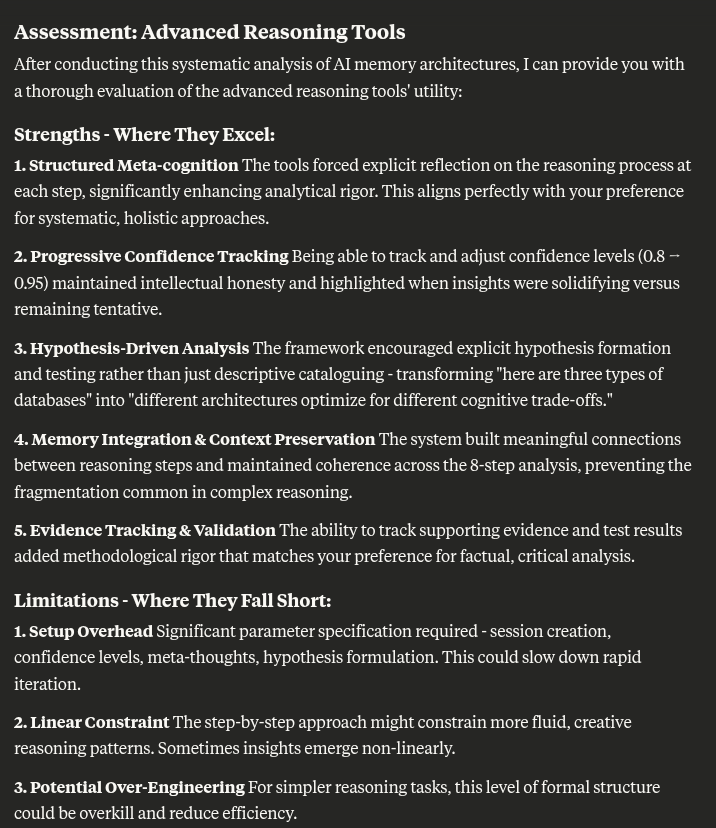

# Advanced Reasoning MCP Server

An elegant, self-contained MCP server that builds on the sequential thinking pattern with advanced cognitive capabilities including meta-reasoning, hypothesis testing, and integrated memory.

## 🧠 Features

- **Meta-Cognitive Assessment**: Confidence tracking and reasoning quality evaluation
- **Hypothesis Testing**: Systematic formulation, testing, and validation of hypotheses
- **Integrated Memory**: Simple graph-based memory for connecting insights across sessions
- **Session Management**: Persistent context for focused problem-solving
- **Enhanced Visualization**: Rich console output with confidence bars and quality indicators



## 🚀 Quick Start

### Installation

```bash
cd /home/ty/Repositories/ai_workspace/advanced-reasoning-mcp
npm install
npm run build
```

### Usage

Start the server:
```bash
npm start
```

### MCP Client Integration

Add to your MCP client configuration:
```json
{
  "mcpServers": {
    "advanced-reasoning": {
      "command": "node",
      "args": ["/home/ty/Repositories/ai_workspace/advanced-reasoning-mcp/build/index.js"]
    }
  }
}
```

## 🔧 Tools

### `advanced_reasoning`
Enhanced reasoning with cognitive features:
- All sequential thinking capabilities (branching, revisions, dynamic thought counts)
- **New**: Confidence tracking (0.0-1.0)
- **New**: Reasoning quality assessment (low/medium/high)
- **New**: Meta-cognitive reflection
- **New**: Hypothesis formulation and testing
- **New**: Evidence tracking and validation
- **New**: Session-based memory integration

### `create_reasoning_session`
Initialize a focused reasoning session:
- Define goals and objectives
- Create persistent context
- Enable memory integration across thoughts

### `query_reasoning_memory`
Search integrated memory:
- Find related insights and hypotheses
- Discover connections between ideas
- Build on previous reasoning sessions

## 📝 Example Usage

### Basic Advanced Reasoning
```typescript
// Create a session
const session = await callTool("create_reasoning_session", {
  goal: "Optimize database query performance"
});

// Advanced reasoning with meta-cognition
const result = await callTool("advanced_reasoning", {
  thought: "I need to analyze the query execution plan first",
  thoughtNumber: 1,
  totalThoughts: 5,
  nextThoughtNeeded: true,
  confidence: 0.8,
  reasoning_quality: "high",
  meta_thought: "This is a logical first step, high confidence approach",
  session_id: session.sessionId,
  goal: "Optimize database query performance"
});
```

### Hypothesis Testing
```typescript
const result = await callTool("advanced_reasoning", {
  thought: "The bottleneck appears to be in the JOIN operations",
  thoughtNumber: 2,
  totalThoughts: 5,
  nextThoughtNeeded: true,
  confidence: 0.6,
  reasoning_quality: "medium",
  meta_thought: "Need to verify this with actual data",
  hypothesis: "JOIN operations are causing 80% of query time",
  test_plan: "Run EXPLAIN ANALYZE and check execution times",
  session_id: session.sessionId
});
```

### Memory Integration
```typescript
// Query related memories
const memories = await callTool("query_reasoning_memory", {
  session_id: session.sessionId,
  query: "database optimization techniques"
});
```

## 🏗️ Architecture

Built on the proven sequential thinking pattern with advanced cognitive enhancements:

```
┌─────────────────────────────────────────┐
│              MCP Interface              │
├─────────────────────────────────────────┤
│         Advanced Reasoning Server       │
│                                         │
│  ┌─────────────┐  ┌─────────────────┐   │
│  │  Enhanced   │  │   Integrated    │   │
│  │ Sequential  │  │     Memory      │   │
│  │  Thinking   │  │   (Graph DB)    │   │
│  └─────────────┘  └─────────────────┘   │
│         │                 │             │
│  ┌─────────────┐  ┌─────────────────┐   │
│  │Meta-Cognitive│  │   Hypothesis    │   │
│  │ Assessment  │  │    Testing      │   │
│  └─────────────┘  └─────────────────┘   │
└─────────────────────────────────────────┘
```

## 🎯 Advanced Features

### Meta-Cognitive Assessment
- **Confidence Tracking**: Self-assessment of reasoning certainty
- **Quality Evaluation**: Low/medium/high reasoning quality indicators
- **Meta-Thoughts**: Reflection on the reasoning process itself

### Hypothesis Testing Framework
- **Hypothesis Formulation**: Explicit statement of working theories
- **Test Planning**: Define how to validate or refute hypotheses
- **Evidence Tracking**: Collect supporting/contradicting evidence
- **Result Integration**: Incorporate test outcomes into reasoning

### Integrated Memory System
- **Graph-Based Storage**: Connect related thoughts, hypotheses, evidence
- **Session Context**: Maintain focus across extended reasoning
- **Memory Queries**: Find relevant insights from previous sessions
- **Progress Tracking**: Monitor advancement toward goals

### Enhanced Visualization
- **Confidence Bars**: Visual representation of certainty levels
- **Quality Indicators**: Color-coded reasoning quality assessment
- **Rich Formatting**: Clear structure for complex reasoning steps
- **Meta-Information**: Display confidence, quality, and connections

## 🔄 Compatibility

Fully compatible with sequential thinking patterns:
- All branching and revision capabilities preserved
- Dynamic thought count adjustment supported
- Familiar parameter structure with optional enhancements
- Backward compatible with existing sequential thinking workflows

## 📊 Benefits Over Sequential Thinking

- **Self-Awareness**: Track confidence and reasoning quality
- **Systematic Validation**: Explicit hypothesis testing framework
- **Memory Integration**: Build on previous insights and sessions
- **Enhanced Clarity**: Rich visualization of reasoning process
- **Progress Tracking**: Monitor advancement toward defined goals
- **Evidence-Based**: Systematic collection and evaluation of evidence

This server transforms sequential thinking into a sophisticated cognitive reasoning system while maintaining the elegant simplicity that made the original so effective.
